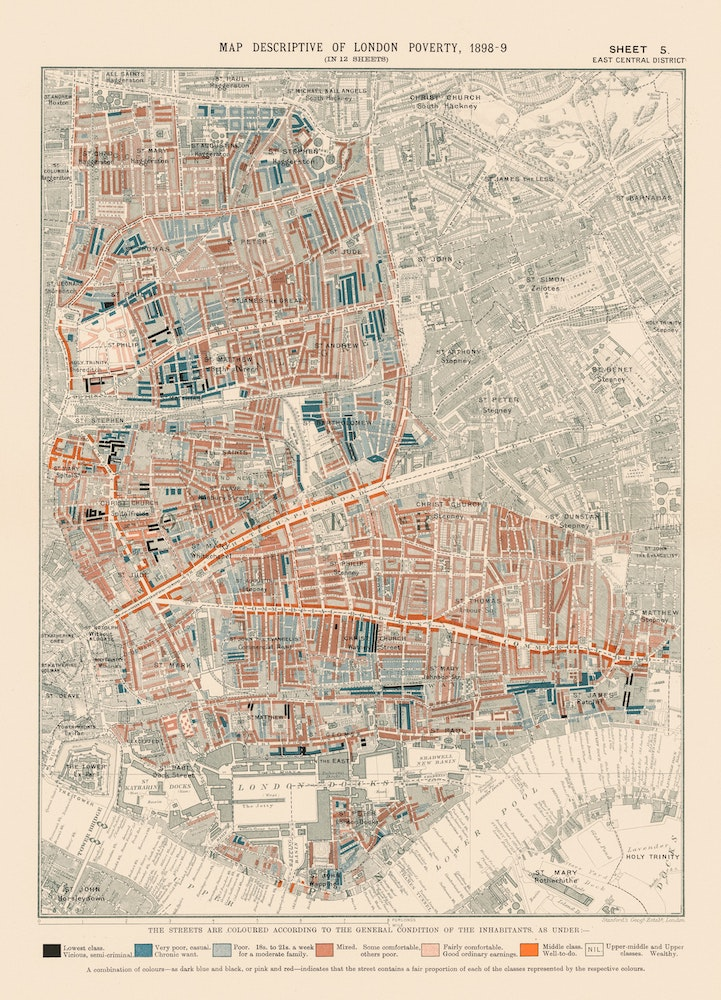

This repo show you how to cut an image up into image tiles and use them as a base for a map.

Basically going from this

to a zoomable leaflet map like this:

Check out the jupyter notebook that show how to do it.

And dive deep in to the functions folder if you need to tweek and tinker.